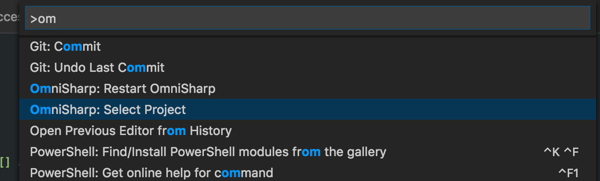
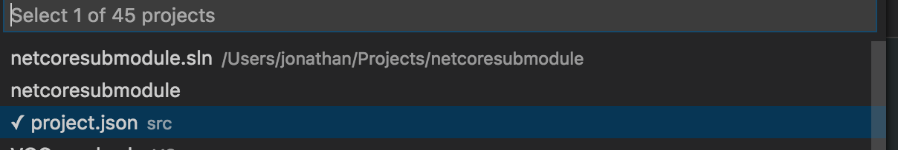

# Customer Helper App Structure

This references ViewModels etc via a git submodule.

In your helper app make sure its based in git (`git init` if not)

Run `git submodule add git@github.com:VQComms/VQ.git`

This creates the VQ folder you see in this repo.

In your app's project.json reference VQViewModels like so `"VQViewModels": { "target": "project" }` https://github.com/VQComms/vqnetcoresubmodule/blob/master/src/project.json

Create a global.json in the root of the folder. See the example in this repo (https://github.com/VQComms/vqnetcoresubmodule/blob/master/global.json)

You can edit this project in Rider by opening the netcoresubmodule.sln.  You can also tell Omnisharp in VSCode to load that sln file to try and get intellisense across your app and VQViewModels.  Your mileage
may vary in that regard.  You may have to tell Omnisharp which project to select. Type CMD + Shift + P and type Omnisharp. See below images.

When coming back to the helper app and you want the latest version of ViewModels run `git submodule update --init --recursive` this pulls latest version of the VQ git repository into your directory.

